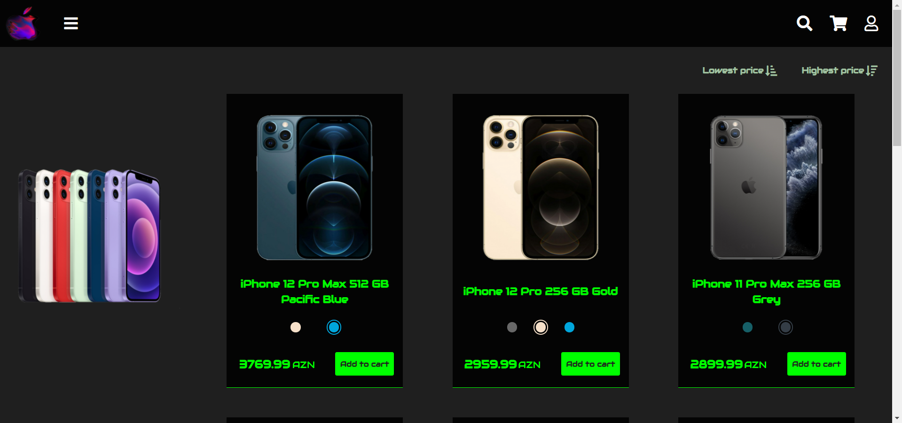
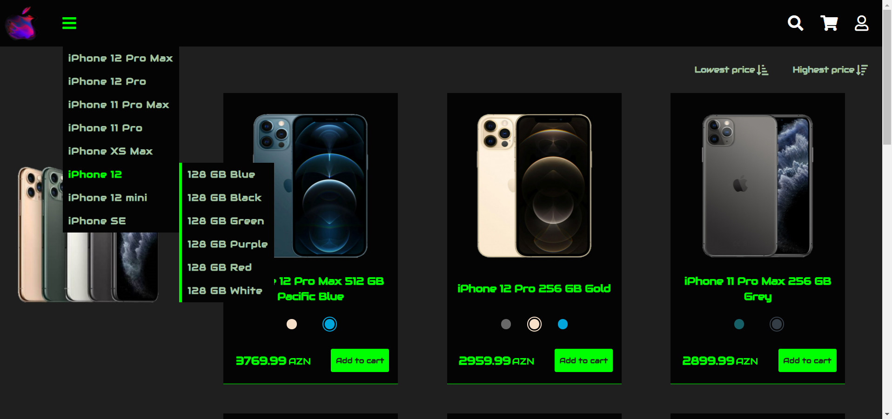
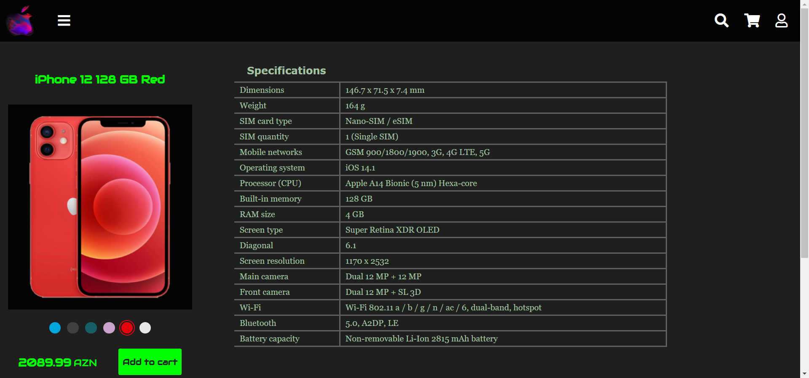
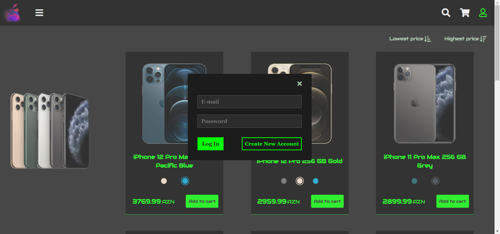
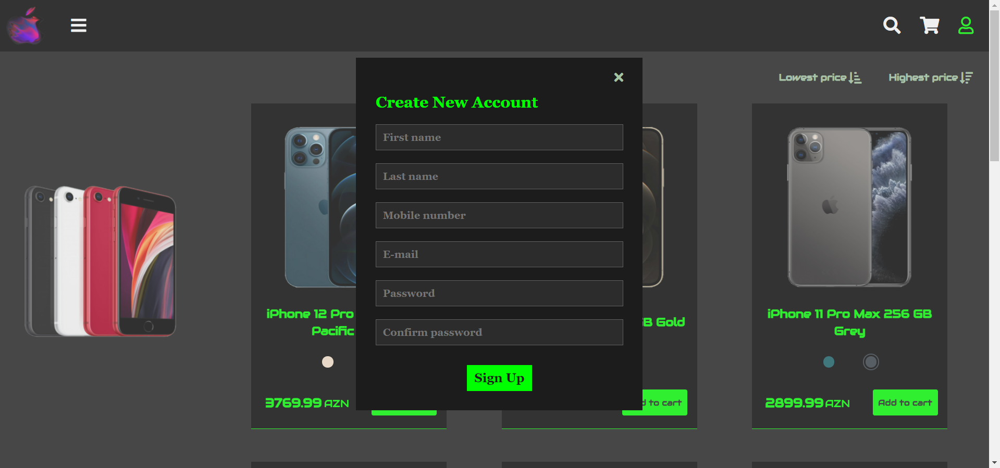
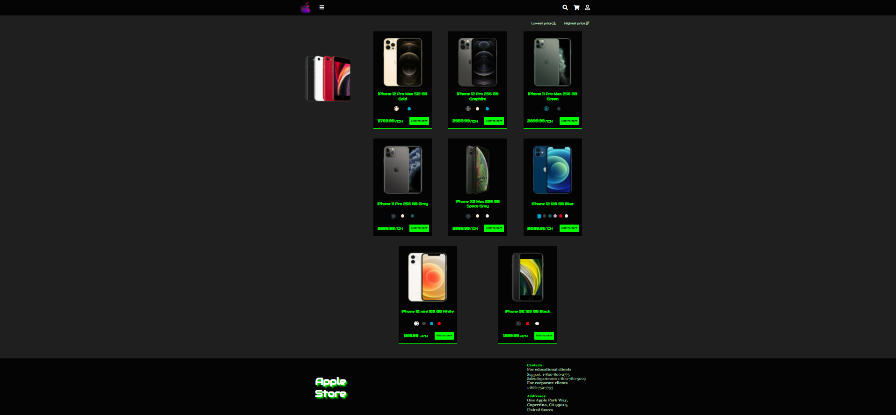

# Mobile phone online store project

### Languages used in the project:
- *Java*
- *SQL*
  - *PostgreSQL*
- *JavaScript*
- *HTML*
- *CSS*

### Other technologies used in the project:
- *Spring*
  - *Spring Boot, Spring Data JPA,Spring WEB MVC, Spring AMQP*
- *SRP-6a*
- *RabbitMQ*
- *Redis*
- *Liquibase*
- *Docker, Kubernetes*
- *Node.js, Webpack*

### Project screenshots:

